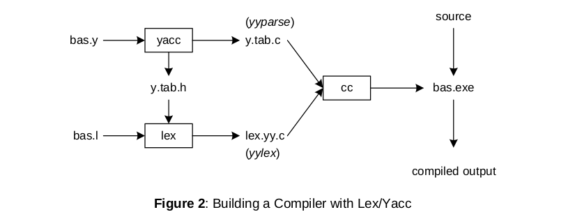

# PT-Mplus-

Flex and Bison are tools for building programs that handle structured input.\
Before install be sure in your path doesn't exist spaces like 'Program files'.\
Add 'GnuWin32/bin' & 'msys64\mingw64\bin to path environment.

**Installers**\
Msys2 - gcc
```
https://www.msys2.org/
```
Bison
```
http://gnuwin32.sourceforge.net/packages/bison.htm
```
Flex
```
http://gnuwin32.sourceforge.net/packages/flex.htm
```

To generate *c.tab.c* & *c.tab.h*:
```
bison -d c.y
```
then add **#include "c.tab.h"** in *lexer.l*.

To generate *lex.yy.c*:
```
flex lexer.l
```  

To generate *MplusMinus.exe*:
```
gcc -o MplusMinus main.c
```

To run:
```
MplusMinus.exe
```

References:
```
https://silcnitc.github.io/ywl.html
```